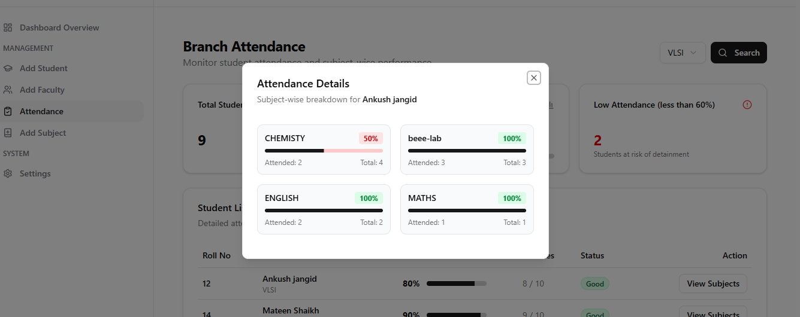
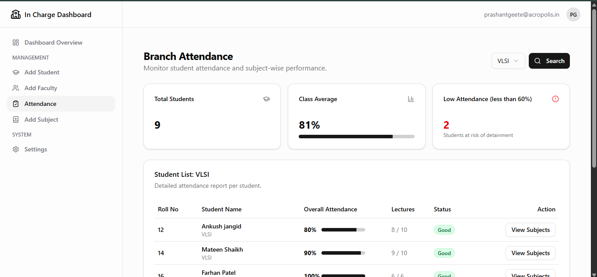
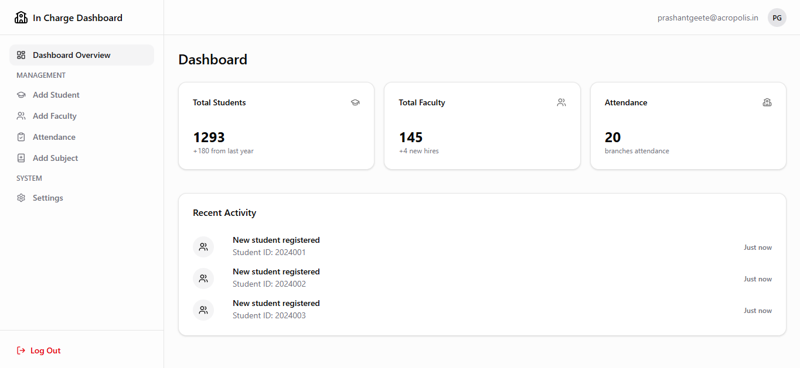
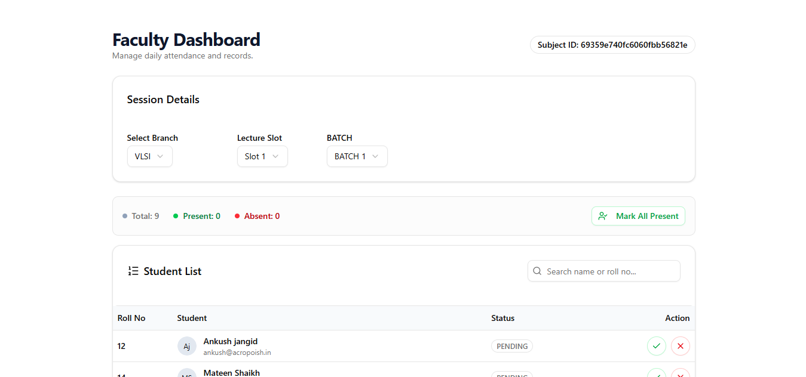
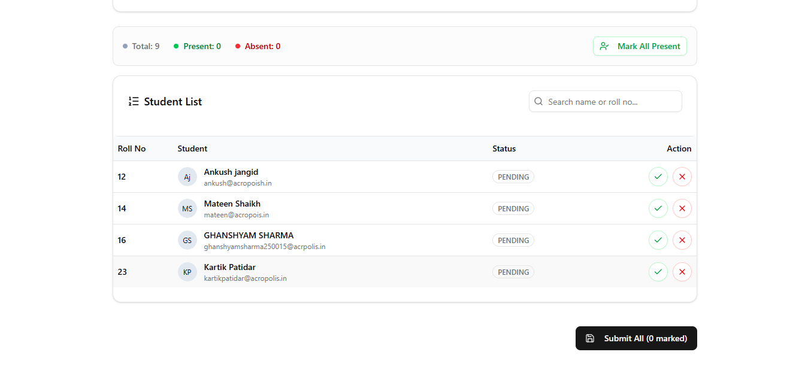

# 🎓 Attendance Management System

A full-stack **Attendance Management System** designed for educational institutes to manage students, faculty, attendance, and academic data with role-based access.

Live Demo: https://attendace-system-sameer.vercel.app

---

## ✨ Features

- 🔐 Role-based authentication (Admin / Faculty)
- 👨‍🎓 Student registration & management
- 👩‍🏫 Faculty management
- 📊 Dashboard with usage overview
- 📝 Attendance tracking
- 🧭 Clean and intuitive UI
- 🚀 Deployed on Vercel

---

## 📸 Screenshots

### Admin Dashboard




### Faculty Dashboard



---

## 🎥 Demo Video

Click below to watch the full demo of the project:

https://github.com/samex111/student-attendance-system/tree/main/client/public/attendance-system-video.mp4


## 🛠 Tech Stack

### Frontend
- React (Vite)
- Tailwind CSS
- React Router

### Backend
- Node.js
- Express.js
- MongoDB

### Auth & Security
- JWT Authentication
- Role-based access control

### Deployment
- Vercel (Frontend)
- Backend deployed separately

---

## ⚙️ Installation & Setup

### 1️⃣ Clone the repository
```bash
git clone https://github.com/samex111/student-attendance-system.git
